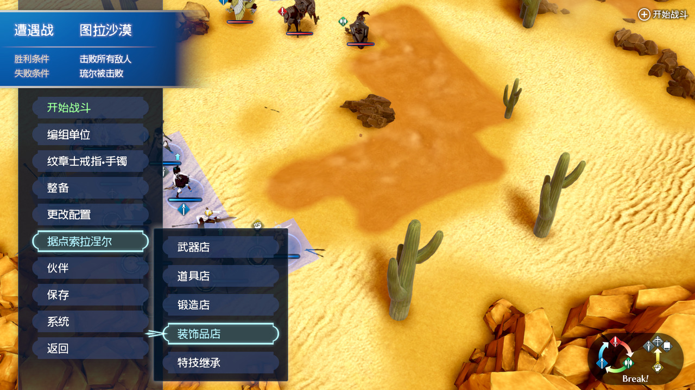
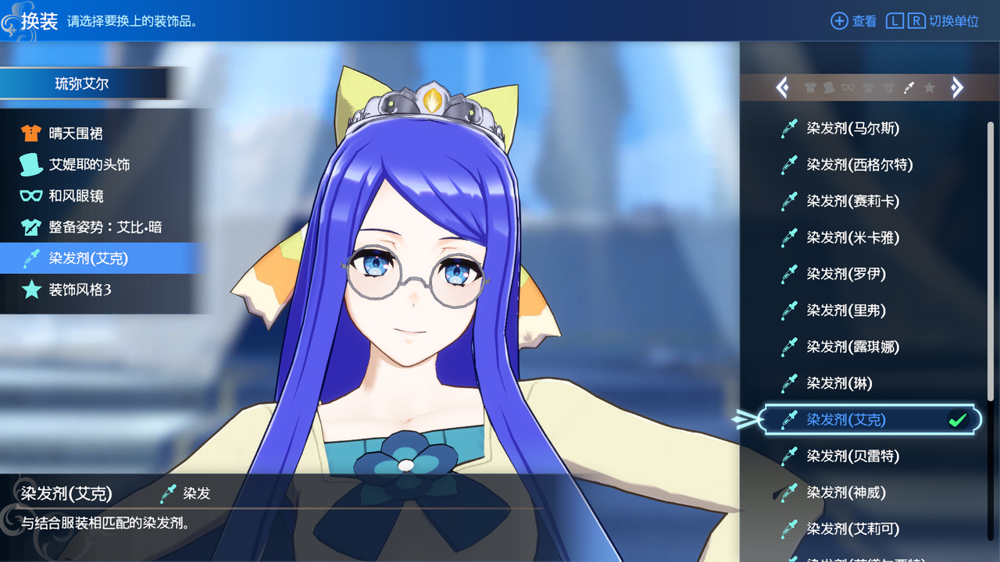
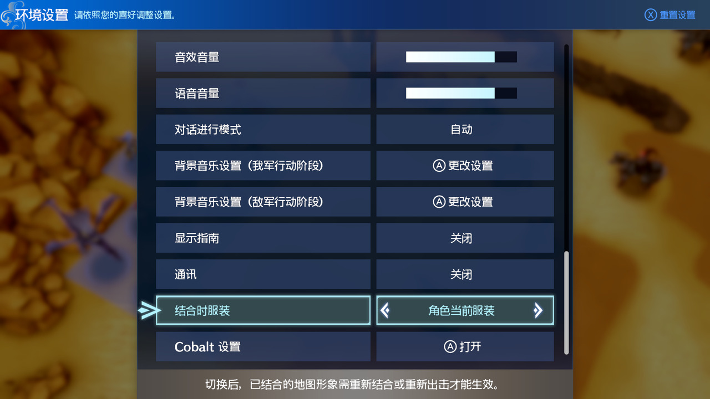

# Fire Emblem Engage — Outfit, Accessory and Menu Enhancements v0.3

[简体中文](README.md)

Open the accessory shop directly from battle preparations for live 3D dressing. Confirm equipment and return to refresh the battlefield appearance before battle. The main update in v0.3 is the upper-right ZL/ZR paging hint on supported screens, making available controls easier to find. Paging also expands to class-change jobs, Emblem rings/bracelets and abilities, item organization, selling and the ring/bracelet catalog. Plugin diagnostics are off by default.

This project is modified and extended from **SierraSak**’s [EngageAcc_Code](https://github.com/SierraSak/EngageAcc_Code) / [Expanded Accessory Slots](https://gamebanana.com/mods/512066). Thank you to SierraSak for the original accessory-slot implementation and resources. Characters use seven available accessory categories. Mask 16 is not exposed as a character slot. The upstream eight-entry storage layout and version 1 save format are retained.

**Install [Cobalt](https://github.com/Raytwo/Cobalt) first.** Thank you to **Raytwo** for developing and maintaining Cobalt and providing the mod-loading foundation used by this project.

The current binary targets Fire Emblem Engage 2.0.0 with Cobalt 1.31.0 as its compatibility baseline.

## New in v0.3

### Paging hints in the upper-right corner

**The main update is the upper-right control hint on supported paging screens.** The native **ZL/ZR Page** glyph and caption appear after the existing hints and follow the current page and input state. Opening the ability list shows its controls; closing it restores the full Emblem ring/bracelet page hints.

Paging captions support Simplified Chinese, Traditional Chinese, Japanese and English. Other native captions follow the game's language. Remapped actions show the native **right-stick-click** glyph. “Press the right stick” means clicking its button.

### Additional paging screens and controls

Paging expands to the **class-change job list, Emblem ring/bracelet and ability lists, Organize Items, selling and the ring/bracelet catalog**.

Press **ZL to page up or ZR to page down** by the currently visible number of rows. Single presses and held-button repeats are supported. Paging stops at either end without wrapping; selection, details and stat previews follow the cursor. Organize Items pages through the active pane only.

| Screen | ZL / ZR | Press right stick | Other controls and changes |
| --- | --- | --- | --- |
| Class-change job list | Page up / down | — | L/R switches units; original ZR sorting removed |
| Emblem ring/bracelet list | Page up / down | Open the ability list | Replaces ZR to open |
| Ability list | Page up / down | Close the ability list | Replaces ZR to close; returning restores parent hints |
| Organize Items | Page up / down in the active list | Switch item panes | Replaces ZL/ZR pane switching |
| Selling | Page up / down | Select or deselect the current item for multiple selection | Replaces ZR multiple selection |
| Ring/bracelet catalog | Page picker and ability lists up / down | — | Ring details without an ability list change entries one visible page at a time |

**Class-change list:** because class sorting is considered infrequently used, its original ZR action is removed and ZR now pages down. The upper-right hints remove the old sorting control and retain L/R Switch Unit. Confirmation, cancellation, eligibility and required items follow the game rules.

**Ability list:** press the right stick to open and close the window; ZL/ZR pages through its contents. The window shows right-stick Close and the paging hint last. Returning to the ring/bracelet page restores the right-stick Ability List caption and the page's other controls. Native availability conditions, detailed help and B to return still apply.

**Organize Items and selling:** the upper-right hints show right-stick pane switching or multiple selection respectively, with ZL/ZR Page last. Trade-mode restrictions, sale category switching, confirmation and total prices follow the game rules.

**Ring/bracelet catalog:** the picker, ability lists and ring details without an ability list show the paging hint last. Native selection, return, category and entry browsing controls are retained.

## New in v0.2: Accessory shop in battle preparations

### Entry location

Before starting battle, open **Somniel → Accessory Shop** in the preparation menu. The new entry sits **below the Smithy and above Skill Inheritance**, so dressing does not require returning to the Somniel. Entry text supports Simplified Chinese, Traditional Chinese, Japanese and English.

The arrow below marks the accessory-shop entry. Enter the shop for live preview.



### Dressing and preview

1. Enter the accessory shop, select buying or changing outfits, and choose a character.
2. Move the cursor through outfits or accessories for live preview. Previewing does not confirm equipment.
3. In lists supporting preview controls, use the right stick to rotate the character and adjust viewing distance.
4. Confirm equipment and exit. Inspect the refreshed battlefield appearance before starting battle.

The preview uses the native accessory-shop scene, camera, lighting and blue background. The previous character remains until the replacement finishes loading. Battlefield health bars, portraits, class markers and related overlays are hidden in the shop; the battlefield interface and camera are restored on exit.

Shop transitions use native fades. Entry fades out the battlefield and waits for the first shop character before fading in. Exit fades out the shop and waits for changed battlefield actors to finish loading before fading the battlefield back in. Each fade takes about **0.25 seconds**; asset loading adds its own waiting time.

### Battlefield refresh on return

On exit, the plugin compares original and final equipment and refreshes only **player characters with existing battlefield actors whose final equipment changed**. All seven visible categories are compared: outfit, head, face, back, battle outfit, hair color and style. Browsing without confirming, or restoring the original selection after changes, causes no extra refresh.

Ordinary confirmed preparation outfits apply through the return refresh without redeploying. Appearance still follows the game's and installed outfit mods' rules: products need corresponding resources, while transformations and Engage states have their own display conditions.

This entry is for **preparations before battle starts**. The Engage outfit preference available during battle is a separate feature below.

## v0.1 Features

- Seven character categories: outfit, head, face, back, battle outfit, hair color and style (Mask 1/2/4/8/32/64/128). Mask 16 is not available as a character slot; the eight-entry storage layout and version 1 save format are preserved.
- Seven menu categories, purchase filters and current-equipment summaries, with unequipped summary rows hidden.
- Adds ZL/ZR page scrolling to Emblem-unit, roster and preparation selection, arenas, cooking selection, support and bond lists, outer item selection, materials and valuables, shop selection and purchases, forging, engraving, exchanges and photo-mode weapon lists. Two-column lists retain the selected column. Inherited-skill and inventory lists gain paging only in states without native ZL/ZR actions; native help and category controls are preserved.
- Camera adjustments for head accessories and alternate styles.
- Engage outfit preference: current character outfit or emblem outfit. Re-engage or redeploy to update an already-engaged map model.

## v0.1 Screenshots and Settings

Multiple accessories, equipment summaries and the Engage outfit preference described below were introduced in v0.1.

The original game allows up to two accessories. With these enhancements, a character can equip multiple accessories simultaneously, with clear entries in the equipment summary on the left. The screenshot shows multiple equipped accessories and the category menu.



### Engage Outfit Setting

Under **System → Settings**, choose the Engage outfit preference: **current character outfit / emblem outfit**.

You can also switch the setting during battle and observe its effect. However, map models that are already engaged require re-engaging or redeploying before the change takes effect. Special transformations, such as dragon transformation, retain their existing rules.



## Diagnostic logging: off by default, manually enabled when needed

The plugin **does not create or append its diagnostic log by default**. No configuration is needed for normal use. Missing or unreadable flags, or contents other than `on` after trimming whitespace (case-insensitive), keep logging off. Dressing, menus and battlefield refresh still work. This switch controls this plugin only, not Cobalt, emulator or other mod logs.

### Enable logging

1. Fully exit the game; stop the current game process when using an emulator.
2. Create the plain-text file **`fee-outfit-menu-debug.flag`** in the SD card's `engage` folder. Ensure its actual name does not end in `.flag.txt`.
3. Save as UTF-8 text containing this single line:

   ```text
   on
   ```

4. Fully restart the game and reproduce the operation under investigation.

The flag is **`sd:/engage/fee-outfit-menu-debug.flag`**. Logs append to **`sd:/engage/fee-outfit-menu-debug.log`**. In an emulator, use its configured virtual SD card directory, for example `<virtual SD card>/engage/fee-outfit-menu-debug.flag`, rather than the game mod folder.

Records cover the preparation entry and shop lifecycle, preview requests and model completion, scene and camera restoration, transition waits, actor refresh and seven-category equipment differences, plus language, Engage outfit settings, paging and errors. Records depend on the execution paths actually taken.

### Disable logging

Delete `fee-outfit-menu-debug.flag` or change its contents to **`off`**, then **fully restart the game**. The value is cached after its first read in the process, so changing the file during play does not apply immediately. Logging stops on the next start. Existing `fee-outfit-menu-debug.log` files are retained as investigation evidence; back up or remove old logs after exiting if desired.

## Download and Installation

Plugin file: [`engage_outfit_menu_enhancements.nro`](Releases/engage_outfit_menu_enhancements.nro); checksums: [SHA256SUMS](Releases/SHA256SUMS).

1. Install the prerequisite runtime using Cobalt's instructions.
2. Place `engage_outfit_menu_enhancements.nro` in the SD card's `engage/mods/engage-outfit-menu-enhancements/` folder.
3. Fully restart the game. For emulators, use the configured virtual SD card directory.

Installed file location:

```text
engage/mods/engage-outfit-menu-enhancements/engage_outfit_menu_enhancements.nro
```

To upgrade, fully exit the game, replace the existing NRO, and restart. Existing configuration and accessory save format are retained; deleting saves is unnecessary. If an outfit integration package includes this plugin, use and upgrade its included copy to avoid loading a second standalone copy.

## Source and Build

See [Build instructions](docs/BUILD.md). This snapshot includes the current implementation and the local dependencies used by it. New builds go to `dist/`, preserving the release binary in `Releases/`.

## License and Credits

Project-owned additions and documentation use the [GNU GPL v3.0](LICENSE), and combined-program distribution must comply with GPLv3. Third-party dependencies, upstream-derived code and resources retain their respective license terms and notices; see [THIRD_PARTY.md](THIRD_PARTY.md) and [NOTICE](NOTICE).

Thanks to [Raytwo](https://github.com/Raytwo/Cobalt), [SierraSak](https://github.com/SierraSak/EngageAcc_Code), [DivineDragonFanClub](https://github.com/DivineDragonFanClub/engage-il2cpp), [skyline-rs](https://github.com/skyline-rs) and all relevant dependency contributors.

## Compatibility and scope

This binary targets the menus and functions in game version 2.0.0. Other game versions are outside its current compatibility scope. Supported paging screens are described in the version feature sections. Inherited-skill paging is enabled only where it does not replace native ZL/ZR help actions. Item organization and selling use the remapped controls described above.

The plugin provides outfit, accessory and menu features. Available products and appearance assets depend on the game and installed outfit mods. The additional outfits and accessories shown in the screenshots are not products supplied by this plugin alone.

See the [Changelog](CHANGELOG.md) for version changes.
